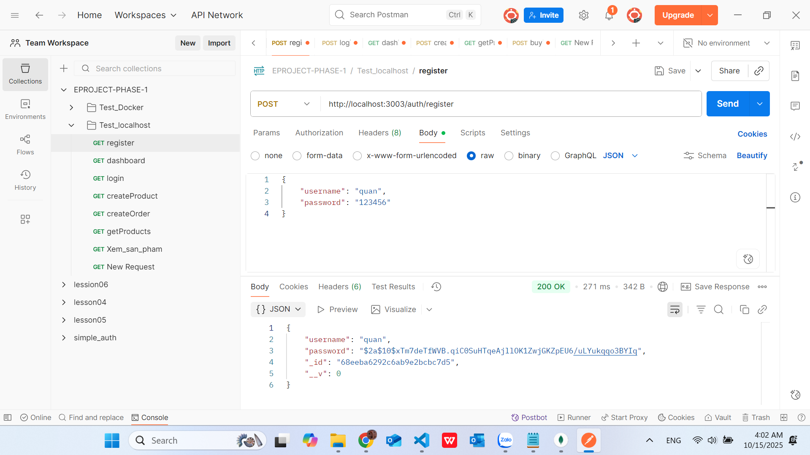
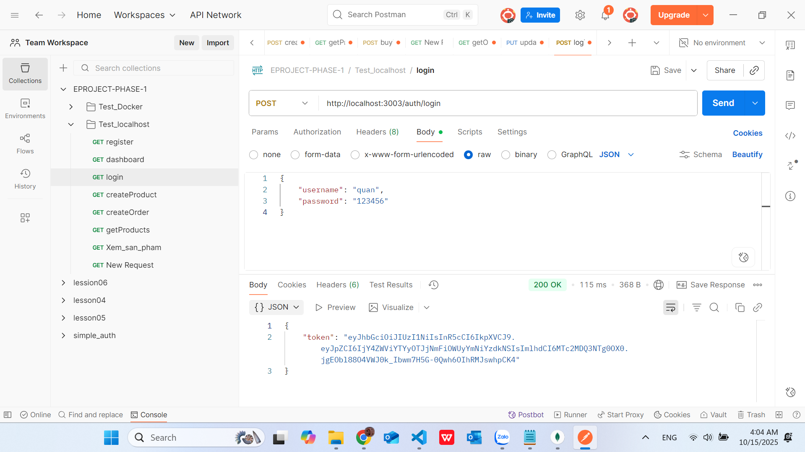
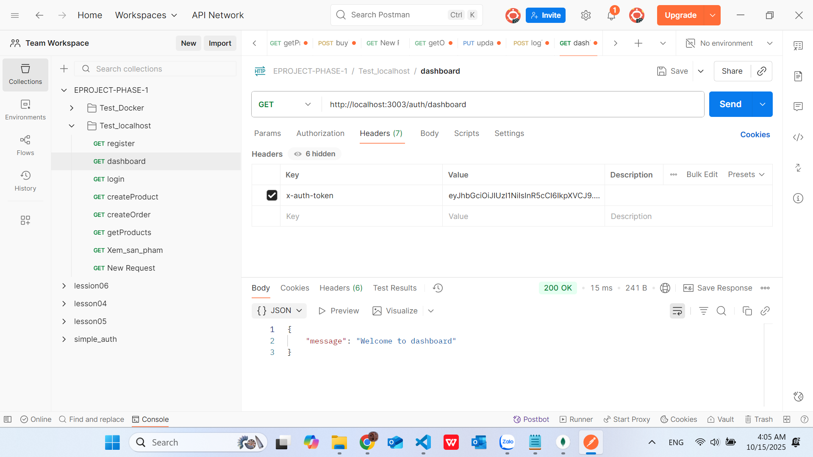
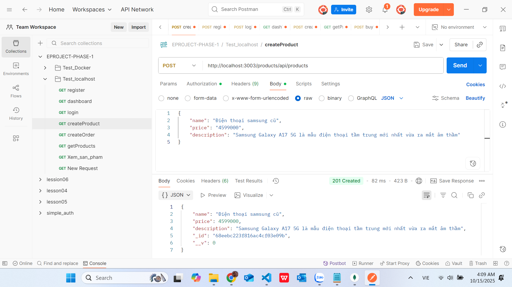
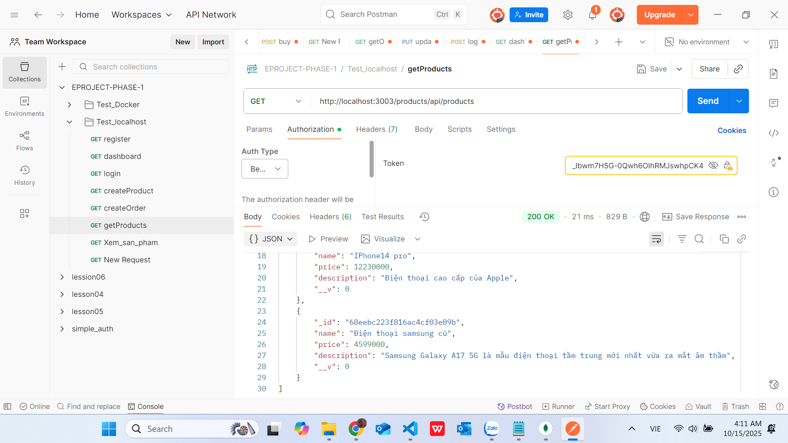
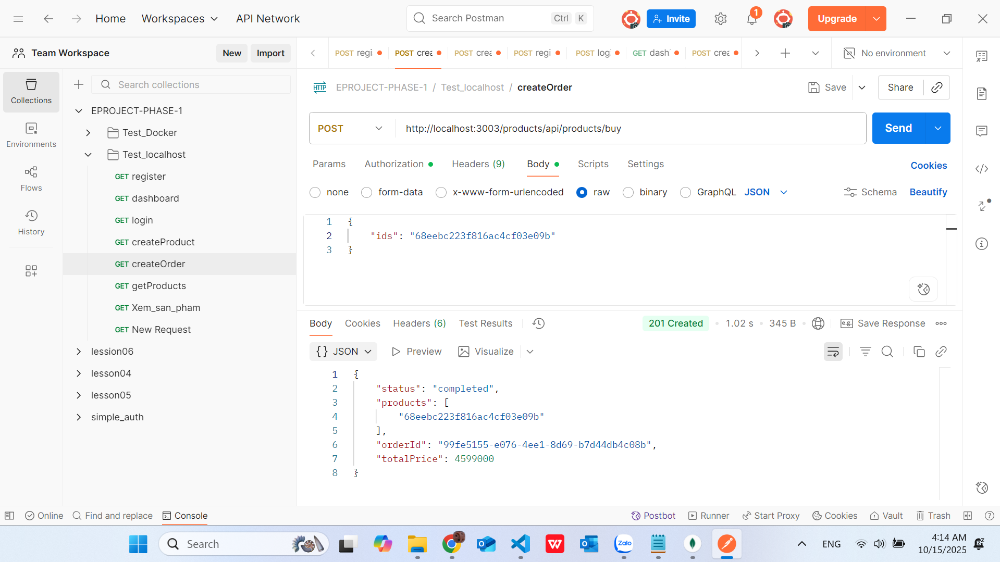
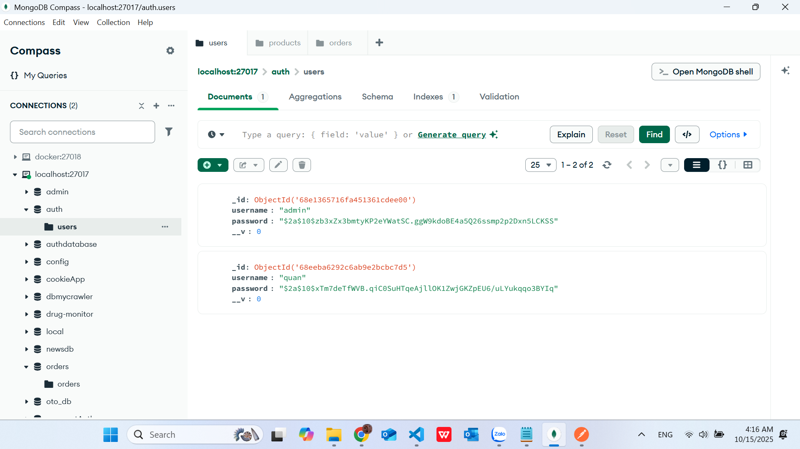
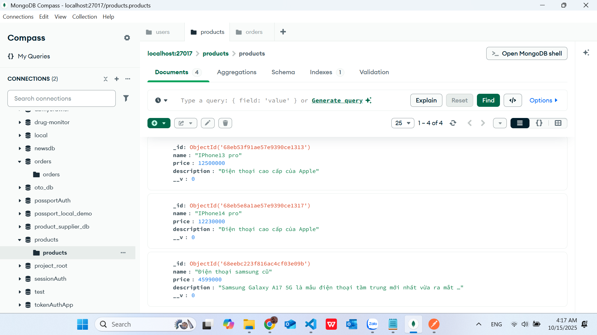
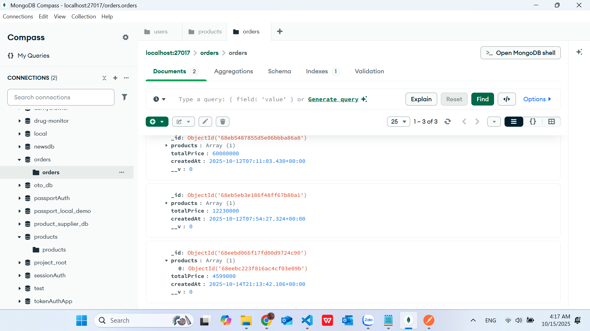

### EProject Phase 1 - Microservices Demo

## Giới thiệu ngắn

Project này là một demo về kiến trúc microservices để học tập. Nó gồm các service tách biệt:

- `auth` - Authentication service (xử lý đăng ký/đăng nhập, trả JWT)
- `product` - Product service (CRUD sản phẩm, publish message khi mua)
- `order` - Order service (consume message để tạo đơn hàng)
- `api-gateway` - API Gateway (định tuyến request từ client tới service tương ứng)

RabbitMQ được sử dụng làm message broker giữa các service (queue tên `products` theo cấu hình mặc định). MongoDB được dùng để lưu dữ liệu cho từng service.

> Lưu ý: dự án này chỉ phục vụ cho mục đích học tập, không dùng cho production.

---

## Cấu trúc thư mục

```
EProject-Phase-1/
 ┣ api-gateway/
 ┣ auth/
 ┣ order/
 ┣ product/
 ┗ README.md
```

Mỗi service chứa:
- `index.js` – Điểm khởi động chính
- `src/` – Controller, route, model
- `.env` – Biến môi trường riêng

---
```

### 2️⃣ Khởi động MongoDB và RabbitMQ
---

### 3️⃣ Khởi động các microservices
Sau khi MongoDB và RabbitMQ ổn định:
---

## 🌐 Đường dẫn truy cập các service
---

## 🧩 Thử nghiệm dự án với POSTMAN

### Auth Service

**1. Đăng ký (Register)**



**2. Đăng nhập (Login)**



**3. Truy cập Dashboard**



### Product Service

**4. Tạo sản phẩm (Create Product)**



**5. Lấy danh sách sản phẩm (Get Products)**



**6. Mua sản phẩm (Buy Product - Create Order)**



### Database (MongoDB)

**7. Dữ liệu Users**



**8. Dữ liệu Products**



**9. Dữ liệu Orders**



---

## Tác giả

- **Sinh viên:** Huỳnh Văn Quân
- **Mã SV:** 22636731
- **Môn học:** Lập trình hướng dịch vụ
